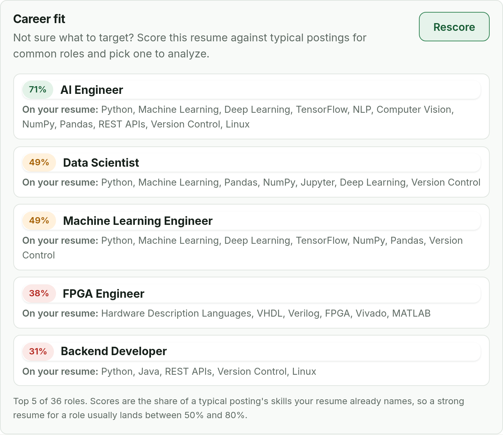
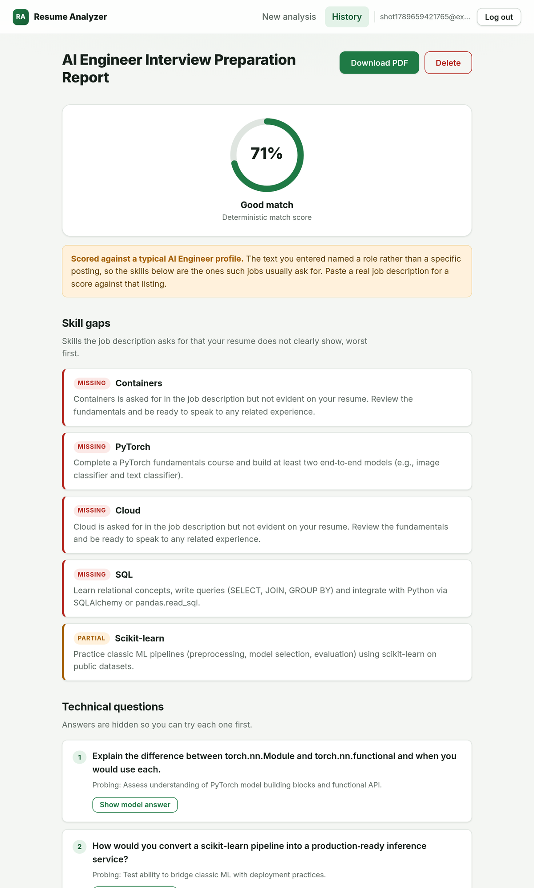
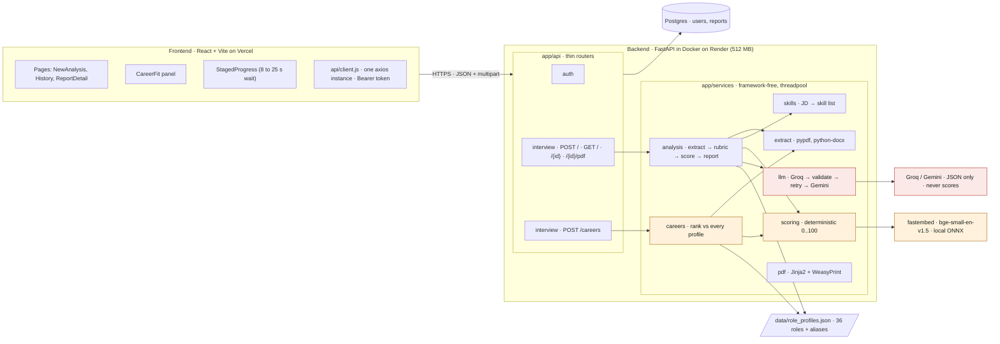
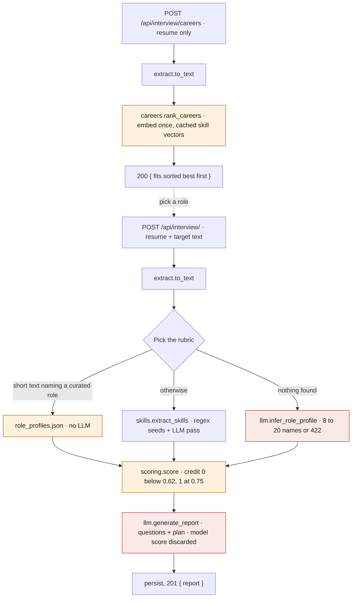

# Resume Analyzer

Upload a resume, paste a job description or just name the role you want,
and get back a structured report: a deterministic match score, a per-skill
gap analysis, technical and behavioral interview questions, and a day-by-day
preparation plan. Export any report as a PDF. Not sure what to target? The
career-fit panel ranks the resume against 36 curated role profiles before
you run anything.

**Live app:** not deployed yet. See [Deployment](#deployment) below; the
project is built and tested locally, ready to push to Render, Vercel, and a
managed Postgres instance.



*The career-fit panel on the new-analysis page: the uploaded resume scored
against 36 curated role profiles, with the skills it already names for each.
Picking a role fills the target box and runs the full report against the
same profile.*



*The report for the same resume against the AI Engineer profile: the same
71% the panel showed, the gaps that drive it, and the start of the
generated questions. The full page continues with behavioral questions and
a 14-day preparation plan.*

## Why this exists

Most "AI resume tool" side projects are a thin wrapper around a single LLM
call, including the score itself, which means the same resume can score
differently on every run. This one splits the work on purpose:

- **The match score is deterministic.** It comes from local embeddings
  (`BAAI/bge-small-en-v1.5` via fastembed), cosine similarity between the
  resume and each skill the job description asks for, and a weighted
  aggregate. No network call, no temperature, no drift: the same resume and
  job description always produce the same score.
- **The LLM only generates text that needs generating.** Interview
  questions, the reasoning behind them, and the prep plan. It never grades
  anything, and if it tries to return a score, that value is discarded.
- **A score of 20% displays as 20%.** Credit for a skill starts at zero
  below the partial threshold, so a resume with none of the skills scores
  near zero rather than the 65 point floor an unanchored cosine similarity
  gives. See DESIGN.md for the formula and the calibration notes.

Three ways to give it a target:

| Input | What it scores against |
| ----- | ---------------------- |
| A pasted job posting | Skills extracted from the posting (regex seed list plus an LLM pass) |
| A role name the app knows ("I want to be an AI Engineer") | The curated profile in `backend/app/data/role_profiles.json`, no LLM call |
| A role name it does not know | A profile the LLM writes on the spot, validated to 8 to 20 atomic skill names |

The career-fit panel and the report use the same scorer and the same
curated profile, so the score you see in the panel is the score the report
gives for that role.

See [ARCHITECTURE.md](ARCHITECTURE.md) for the full system design (with a
draw.io diagram in [docs/architecture.drawio](docs/architecture.drawio)) and
[DESIGN.md](DESIGN.md) for the API contract and scoring formula.

## Architecture



Orange is the deterministic path, red the generative one. The scorer never
calls the network; the LLM never produces a number that reaches the report.



An editable copy of both diagrams is in
[docs/architecture.drawio](docs/architecture.drawio); the prose version
with the reasoning behind each choice is [ARCHITECTURE.md](ARCHITECTURE.md).

## Stack

| Layer      | Choice                                             |
| ---------- | --------------------------------------------------- |
| Backend    | FastAPI, SQLModel, Alembic                          |
| Scoring    | fastembed (ONNX, `bge-small-en-v1.5`), pure Python   |
| LLM        | Groq (primary), Gemini (fallback)                    |
| Database   | Postgres (Supabase or Neon), SQLite for local/tests  |
| PDF export | Jinja2 + WeasyPrint                                  |
| Frontend   | React + Vite, react-router, axios                    |
| Auth       | JWT bearer token (not cookies; see ARCHITECTURE.md)  |

## Project status

Every phase in [PHASES.md](PHASES.md) is implemented and tested locally:

- Backend: 104 tests passing. PDF rendering tests skip themselves on a
  machine without WeasyPrint's native libraries; see
  [Running tests](#running-tests).
- Frontend: builds cleanly, lints cleanly.
- LLM providers: both Groq and Gemini keys work and have been exercised
  live end-to-end (real report generation, and a genuine Groq-failure ->
  Gemini-fallback run), not just mocked. Model defaults are `openai/gpt-oss-120b`
  and `gemini-3.6-flash`. Both provider catalogs move fast, so if either
  starts returning 404s, that model has likely been retired; check the
  provider's current model list and update `backend/.env`.
- Scoring has been checked against three real resumes across a dozen
  role targets (Phase 10). That is what moved the partial threshold to 0.62
  and anchored the credit curve; it is still a small set, and the 20-pair
  calibration in `DESIGN.md` remains open.
- Not yet done: an actual deploy to Render/Vercel/Supabase.

## Running it locally

### Prerequisites

- Python 3.12+ (3.13 works; the Docker image targets 3.12)
- Node 20+
- A Groq API key and a Gemini API key (both have free tiers) if you want the
  LLM step to actually produce questions instead of failing over to
  `LLM_UNAVAILABLE`

### Backend

```bash
cd backend
python -m venv .venv
.venv\Scripts\activate       # Windows; use `source .venv/bin/activate` on macOS/Linux
pip install -r requirements.txt
copy .env.example .env       # then fill in JWT_SECRET, GROQ_API_KEY, GEMINI_API_KEY
uvicorn main:app --reload
```

The API is now at `http://localhost:8000`. With `DATABASE_URL` left at its
SQLite default, tables are created automatically on startup; against a real
Postgres URL, run migrations instead:

```bash
alembic upgrade head
```

The first analysis request downloads the fastembed model (~130 MB) if it
isn't already cached; the Docker image bakes this in at build time so
production never pays that cost.

### Frontend

```bash
cd frontend
npm install
copy .env.example .env.local   # VITE_API_URL, defaults to http://localhost:8000/api
npm run dev
```

The app is now at `http://localhost:5173`.

### Running it again later

Once the one-time setup above is done, starting both servers is just:

```bash
# terminal 1, from backend/
.venv\Scripts\activate
uvicorn main:app --reload

# terminal 2, from frontend/
npm run dev
```

Then open `http://localhost:5173`.

A few things that trip people up:

- **Both servers need to be running at once**, in two separate terminals;
  the frontend can't reach the backend otherwise.
- If PowerShell refuses to run `activate` (a script execution policy
  error), either run `Set-ExecutionPolicy -Scope Process -ExecutionPolicy Bypass`
  first, or activate via `.venv\Scripts\activate.bat` from `cmd.exe` instead.
- `--reload` watches Python files, not `.env`. If you edit `backend/.env`
  (say, to add a real database URL), stop the server (`Ctrl+C`) and start
  it again for the change to take effect.

### Running tests

```bash
cd backend
pytest
ruff check .
ruff format --check .
```

```bash
cd frontend
npm run lint
npm run build
```

PDF export tests are skipped automatically if WeasyPrint's native libraries
(Pango, GDK-Pixbuf, Cairo) aren't installed, which is the normal case on a
bare Windows machine. They run for real in the Docker image, where those
libraries are installed via `apt-get`. To test PDF export locally on
Windows, follow WeasyPrint's
[Windows install steps](https://doc.courtbouillon.org/weasyprint/stable/first_steps.html#windows),
or just build the Docker image.

## Deployment

Not deployed yet. Once you have accounts:

1. **Database:** create a Postgres instance on [Supabase](https://supabase.com)
   or [Neon](https://neon.tech), copy the pooled connection string into
   `DATABASE_URL`.
2. **Backend:** point a Render Docker service at `backend/Dockerfile`. Set
   every key from `backend/.env.example` in Render's dashboard. Run
   `alembic upgrade head` against the production database before the first
   deploy.
3. **Frontend:** point a Vercel project at `frontend/`, with `VITE_API_URL`
   set to the Render backend's URL plus `/api`.

**Cold starts:** Render's free tier sleeps after 15 minutes idle and takes
30 to 50 seconds to wake up. The frontend's staged progress screen accounts
for a slow analysis request, but the very first request after a sleep will
be slower still. An external cron ping every 10 minutes avoids this at the
cost of the instance never really sleeping.

## Known limitations

- **No refresh tokens, password reset, or email verification.** Sessions
  last 24 hours; expiry just logs you out. See ARCHITECTURE.md for why.
- **Scoring is keyword coverage, honestly labelled.** A skill counts as
  covered when the resume names it (or a listed alias) or the embedding
  similarity clears 0.75. Short names against long resume chunks rarely
  clear that bar on similarity alone, so in practice the score is close to
  "share of the profile's skills your resume names". A strong candidate
  usually lands between 50% and 80%. Thresholds were adjusted on three real
  resumes; a wider calibration set is still open.
- **Curated role profiles are a starting set.** 36 roles, drafted by the
  LLM once and reviewed by hand. Expect a few false positives from ordinary
  words as real resumes come through, and fix them in the JSON, not in code.
- **Rate limiting is in-process**, correct for a single Render instance,
  wrong the moment a second worker exists (see `app/core/limiter.py`).
- **No job scraping, multi-resume comparison, or resume rewriting.** Out of
  scope for v1; see `DESIGN.md`.

## Repository layout

See [STRUCTURE.md](STRUCTURE.md) for the full file-by-file layout and the
rules for each directory.

## License

Personal / portfolio project. No license file yet; ask before reusing.
